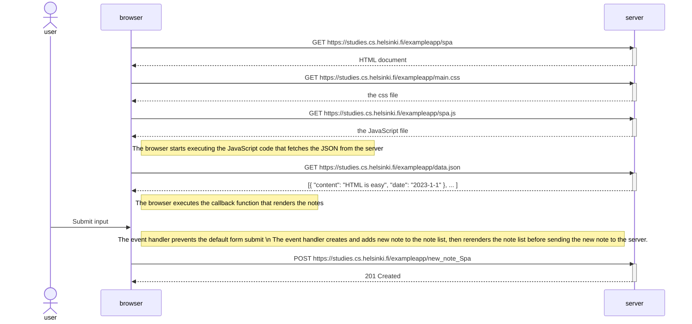

# Single Page App diagram
User creates a new note on [notes](https://studies.cs.helsinki.fi/exampleapp/notes) by writing something into the text field and clicking **Save** button.

```mermaid
sequenceDiagram
actor user
    participant browser
    participant server

    browser->>server: GET https://studies.cs.helsinki.fi/exampleapp/spa
    activate server
    server-->>browser: HTML document
    deactivate server

    browser->>server: GET https://studies.cs.helsinki.fi/exampleapp/main.css
    activate server
    server-->>browser: the css file
    deactivate server

    browser->>server: GET https://studies.cs.helsinki.fi/exampleapp/spa.js
    activate server
    server-->>browser: the JavaScript file
    deactivate server

    Note right of browser: The browser starts executing the JavaScript code that fetches the JSON from the server

    browser->>server: GET https://studies.cs.helsinki.fi/exampleapp/data.json
    activate server
    server-->>browser: [{ "content": "HTML is easy", "date": "2023-1-1" }, ... ]
    deactivate server

    Note right of browser: The browser executes the callback function that renders the notes

    user->>browser: Submit input
    Note right of browser: The event handler prevents the default form submit \n The event handler creates and adds new note to the note list, then rerenders the note list before sending the new note to the server.

    browser->>server: POST https://studies.cs.helsinki.fi/exampleapp/new_note_Spa
    activate server
    server-->>browser: 201 Created
    deactivate server
```